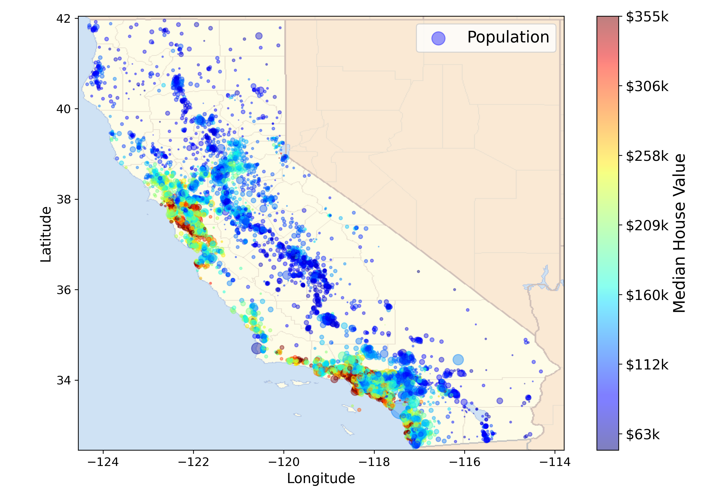

# 🏡 Home Price Prediction — ML Hands-On

Welcome to the `ml-hands-on` repository! This project is a practical implementation of machine learning workflows to predict house prices. It covers raw data processing, training regression models, creating pipelines, and exploring improved techniques.

---

## 📁 Repository Structure

```
ml-hands-on/
├── Home_price_list.csv                     # Dataset for basic models
├── Home_price_prediction.ipynb             # Basic Linear Regression notebook
├── Home_price_pred_Pipeline.ipynb          # ML pipeline-based version
└── new_approach/
    ├── Housing.csv                         # Alternate dataset
    └── housing_pred_cal_ml.ipynb           # Newer approach with deeper feature engineering
```

---


## 📌 Project Objectives

- Build regression models to predict housing prices
- Use Scikit-learn for modeling and preprocessing
- Apply pipelines for clean, reproducible code
- Experiment with different datasets and techniques

---

## 📊 Datasets

### 🏘️ `Home_price_list.csv`

Basic dataset with features like:
- Area
- Number of bedrooms
- Price

### 🏡 `Housing.csv`

Found in `new_approach/`, includes:
- Advanced features
- More room for experimentation

---

## 🧠 Notebooks Summary

### 📘 `Home_price_prediction.ipynb`

- Loads and explores dataset
- Trains a simple Linear Regression model
- Visualizes results

### 📗 `Home_price_pred_Pipeline.ipynb`

- Introduces `Pipeline` and `ColumnTransformer`
- Handles preprocessing and modeling together
- More robust and production-friendly

### 📙 `housing_pred_cal_ml.ipynb`

- Uses the dataset in `new_approach/Housing.csv`
- Adds feature engineering
- Prepares a better, more scalable solution

---

## 🚀 Getting Started

### 🔧 Clone the Repository

```bash
git clone https://github.com/mtptisid/ml-hands-on.git
cd ml-hands-on
```

### 🧰 Install Dependencies

```bash
pip install -r requirements.txt
```

> To create a `requirements.txt`:
> 
> ```bash
> pip freeze > requirements.txt
> ```

### ▶️ Run the Notebooks

Use Jupyter:

```bash
jupyter notebook
```

Or open in VS Code / Jupyter Lab.

---

## 🛠 Tech Stack

- Python 3.x
- Pandas, NumPy
- Matplotlib, Seaborn
- Scikit-learn

---

## 📈 Sample Output

- Model performance metrics: R², MSE
- Visualizations: price distribution, prediction vs actual
- Reusable pipelines

## 🖼️ Sample Visualization

Below is a preview of the California Housing Prices visualization generated in `housing_pred_cal_ml.ipynb`:



---

## 🔮 Future Ideas

- Use `joblib` or `pickle` for saving models
- Add Streamlit-based UI
- Test ensemble models (`RandomForest`, `XGBoost`)
- Hyperparameter tuning with `GridSearchCV`

---

## 🤝 Contribution

Fork the repo, improve notebooks, and submit PRs. All contributions are welcome!

---

## 🙋‍♂️ Author

**Siddharamayya M**  
📧 msidrm455@gmail.com  
🌐 [my Website](https://siddharamayya.in)
🌐 [Portfolio](https://portfolio.siddharamayya.in)  
📞 +91 9740671620
